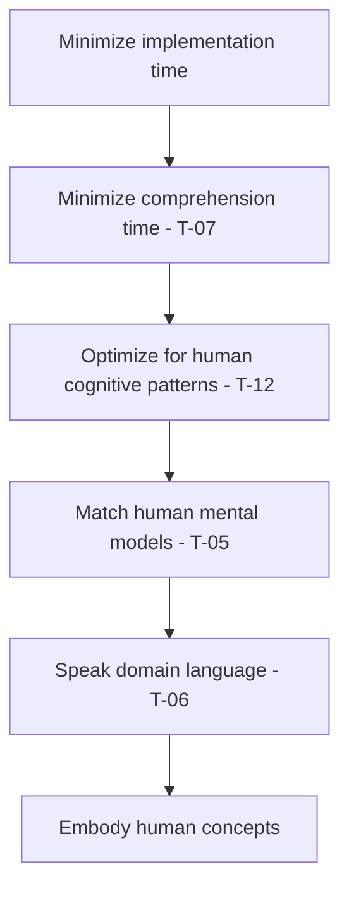
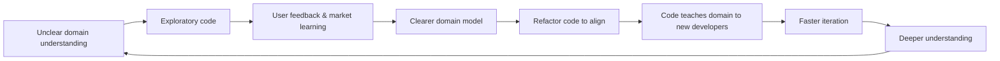

# General Discussion

## Epistemological Foundations

### The Nature of This Framework

This framework occupies a specific epistemological position that should be clearly understood. It is neither pure mathematics (unfalsifiable within its axioms) nor mere operationalization (arbitrary metrics without theoretical grounding). Instead, it resembles thermodynamics or information theory—empirically grounded frameworks that establish fundamental limits and relationships.

**What This Framework Actually Is:**

- A measurement theory that starts from a genuinely fundamental quantity (time)
- A system of falsifiable predictions about software development dynamics
- A set of boundary conditions that constrain all possible software architectures
- An optimization framework where "all else being equal" precisely defines the optimization space

**What This Framework Is Not:**

- Universal laws that must hold in all contexts
- Arbitrary metrics like "lines of code" or "cyclomatic complexity"
- Unfalsifiable philosophy about software "quality"
- Prescriptive rules about specific implementations

### Critical Epistemological Strengths

**The Specification Speed Limit (T-02) establishes a hard boundary.** You cannot implement what you haven't specified—this isn't empirical but logically necessary. Like Shannon's channel capacity or Carnot's efficiency limit, it defines what's theoretically possible. This boundary becomes practically relevant as AI approaches it, transforming specification from bottleneck to fundamental limit.

**Time genuinely is fundamental.** Unlike constructs like "maintainability" or "elegance," time is:

- Universally measurable
- Directly experienced by all stakeholders
- Convertible to economic value
- The actual constraint on all development

The "all else being equal" clause in T-01 isn't weakness but precision. It defines an optimization space where, given equivalent outcomes on all other dimensions, time becomes the decisive factor. This is how optimization problems work—you constrain some variables to optimize others.

**The framework makes testable predictions.** The comprehension discontinuity factor (α ≈ 0.2), change persistence patterns, and coupling measurements are falsifiable claims. If empirical studies show comprehension time grows linearly rather than exponentially with discontinuities, the framework would need revision. This falsifiability is what makes it science rather than philosophy.

### Counter-Arguments and Limitations

**"This reduces software to mechanics."** The framework describes mechanisms, not meanings. It tells you how long things take, not what's worth building. The choice of what to optimize for—features, security, performance—remains a human value judgment. The framework simply ensures that whatever you choose, you achieve it in minimal time.

**"Software isn't physics."** True. Software lacks conservation laws and fundamental constants. But it does have:

- Information-theoretic limits (specification boundary)
- Cognitive constraints (working memory, attention)
- Economic realities (time costs money)
- Organizational dynamics (Conway's Law)

The framework captures these constraints without claiming they're laws of nature.

**"This ignores software craftsmanship."** The framework actually validates craftmanship by showing that well-crafted code (high coherence, low coupling, domain alignment) measurably reduces future implementation time. It transforms aesthetic arguments into economic ones—"beautiful" code is often economically optimal code.

## The Humanistic Convergence

### The Paradox of Mechanical Optimization

By rigorously optimizing for time—a seemingly cold, mechanical metric—these principles lead to profoundly humanistic outcomes. This isn't a coincidence but a mathematical necessity: the most time-efficient code is the most human code.

### Why Time Optimization Produces Human Code

The convergence isn't accidental but mathematically inevitable:

Each arrow represents a logical necessity, not a correlation. To minimize total time, you must minimize comprehension time. To minimize comprehension time, you must respect cognitive limits. To respect cognitive limits, you must match mental models. The chain is unbreakable.

### Code as Human Communication

In a principled codebase:

- **File names** are domain concepts, not technical patterns
- **Function names** are business operations, not technical operations  
- **Module boundaries** match conceptual boundaries in human minds
- **Evolution** follows human learning and market discovery

The ultimate domain-specific language isn't a new syntax—it's code that speaks the language of the domain, where business experts can guess where functionality lives and new developers find features by thinking "where would I naturally put this?"

### The Learning Loop

Principled development creates a virtuous cycle of human understanding:

### Refactoring as Teaching

The most important refactors aren't technical improvements but **teaching the code what we've learned**:

- Renaming when terminology clarifies
- Splitting when concepts differentiate
- Merging when concepts unify
- Restructuring when boundaries shift

This makes refactoring a deeply human act—updating our shared understanding encoded in the system.

### The Market Fit Connection

There's a profound connection between code quality and product-market fit:

- Clear market understanding → Clear domain model → Clear code
- Clear code → Faster iteration → More market learning
- The code quality reflects and enables business understanding

## Specific Mechanisms of Convergence

**Conceptual Alignment (T-05)** forces code structure to match how humans think about the problem. This isn't aesthetic preference—misaligned architecture creates unnecessary merge conflicts, coordination overhead, and cognitive load, all measurably increasing time.

**Domain Tracking (T-06)** ensures code evolves with human understanding. Using outdated terminology or wrong abstractions increases comprehension time for every future developer. The fastest code to understand is code that speaks the current language of the domain.

**Comprehension Continuity (T-12)** respects working memory limits. The exponential cost of discontinuities isn't arbitrary—it reflects how human cognition actually works. Code organized for human reading patterns is measurably faster to modify.

## Validation of Developer Intuition

When experienced developers say code "feels right," they're detecting time optimizations:

- **"This is elegant"** → Low discontinuity count
- **"This is intuitive"** → High conceptual alignment
- **"This is clean"** → High coherence, low coupling
- **"This tells a story"** → Comprehension continuity

The framework doesn't replace intuition but explains why intuition works. Expert developers have internalized these time optimizations through experience.

### The Human Metrics

The most important measurements aren't technical but human:

- Can a new developer guess where features live?
- Does the code teach you the domain?
- Do domain experts recognize their concepts in the code?
- Does reading the code feel like reading documentation?

## Implications for AI-Assisted Development

As AI approaches the specification speed limit (T-02), human value shifts entirely to:

1. **Specification clarity**—the bottleneck becomes how well we communicate intent
2. **Architectural decisions**—AI can implement any architecture quickly, but which minimizes future time?
3. **Domain understanding**—AI needs human insight into what the domain actually requires

This isn't replacement but elevation. Humans move from typing to designing, from implementing to architecting, from coding to teaching the AI what to build.

## The Ultimate Test

A principled codebase optimizes for time so thoroughly that:

- New developers guess where features live (high conceptual alignment)
- Code teaches the domain (domain tracking)
- Reading code feels like reading documentation (comprehension continuity)
- The git history tells the story of learning (evolutionary record)
- Changes cluster in predictable places (high coherence)
- Failures don't cascade (low coupling)
- Debugging feels like following a narrative
- The architecture emerges from human understanding, not technical dogma

These aren't separate goals but natural consequences of time optimization.

## Counter to Dehumanization

This framework doesn't make software development less human—it proves that human-centered development is mathematically optimal. It bridges:

- What feels right intuitively ↔ What is right mathematically
- Developer experience ↔ Time optimization
- Code quality ↔ Business value
- Technical excellence ↔ Human understanding

## Conclusion: The Framework's Real Achievement

This framework doesn't discover universal laws of software but provides something arguably more valuable: a measurement theory that transforms subjective quality arguments into objective time measurements. It shows that:

1. **Good code is fast code**—fast to understand, fast to change, fast to fix
2. **Human code is optimal code**—respecting cognition minimizes time
3. **Practices can be validated**—not by authority but by measurement
4. **Architecture can be prescribed**—based on change history, not opinion

The framework resembles thermodynamics: it doesn't tell you which engine to build, but it tells you the efficiency limits of any engine you might build. It doesn't prescribe specific architectures, but it reveals the time costs of architectural decisions.

Software engineering has operated on opinion and authority for too long. This framework offers an alternative: measurement, prediction, and optimization based on the one resource that actually matters—time.

### Time is Human

The deepest insight of these principles is that time optimization is human optimization. Every second saved is a human second. Every comprehension speed-up is a human understanding. Every proximity improvement is a human mental model respected.

By optimizing for time, we're optimizing for the humans who spend that time. The framework doesn't dehumanize development—it reveals that humane development is optimal development.

Good code isn't just efficient—it embodies human understanding.