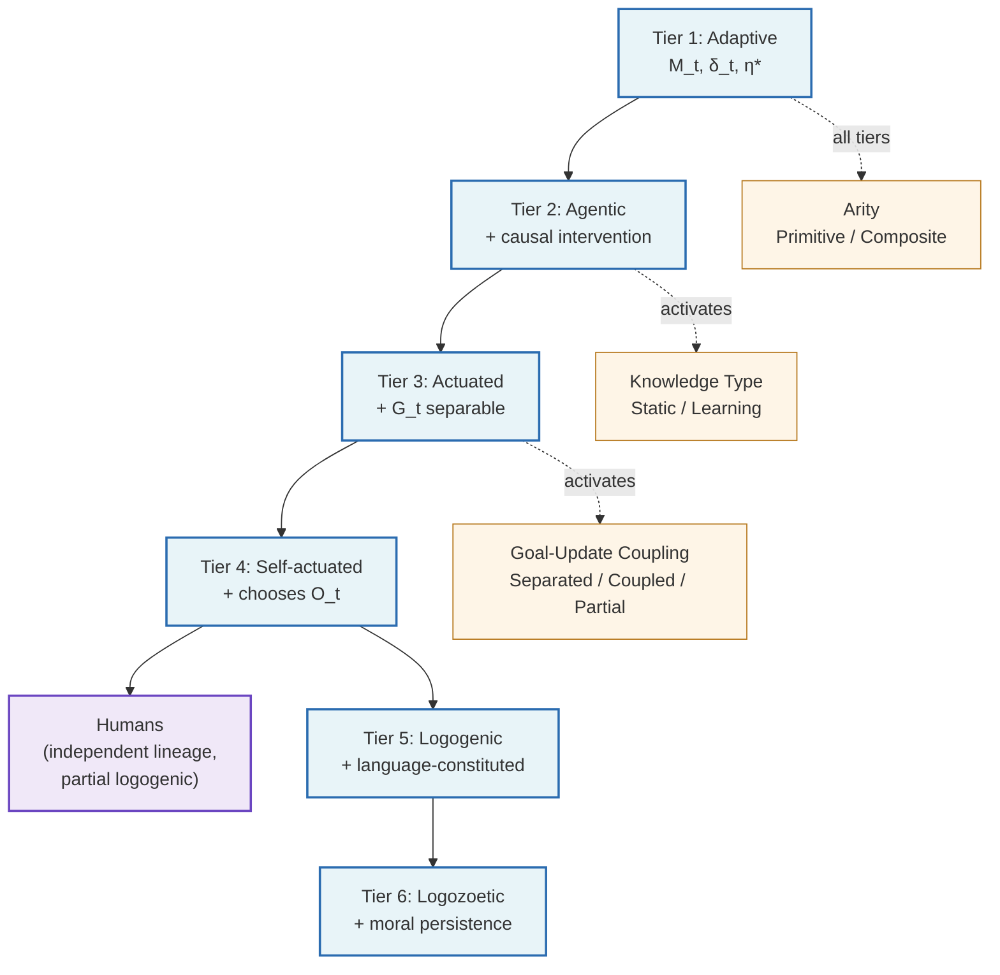

# Updated Agent Ontology — Proposal

A re-presentation of ASF's agent classification as a *small lattice* over
four orthogonal axes — the semantic ladder is the spine; the other axes
are sub-classifications that activate at the tiers where they're
meaningful. Names used throughout for the goal-update coupling classes:
**Separated / Coupled / Partial**.

## The four axes

### Semantic Tier Axis:
Adaptive | Agentic | Actuated | Self-actuated | Logogenic | Logozoetic

What kind of agent it *is* — the primary ladder. Each tier is a
progressive narrowing.

| Tier | Class | What it adds | AAD boundary | Examples |
|---|---|---|---|---|
| 1 | **Adaptive system** | Feedback loop + mismatch correction under uncertainty: $M_t$, $\delta_t$, $\eta^*$, recursive update | `#scope-adaptive-system` | Thermostat, Kalman filter, bacterium, biological homeostasis |
| 2 | **Agentic system** | + at least one action that is a *causal intervention* (intervenes on the environment, not just regulation toward a setpoint) | `#scope-agency` | RL agents, MCTS, immune system, SLAM |
| 3 | **Actuated agent** | + explicit $G_t = (O_t, \Sigma_t)$ *separable* from $M_t$ | `#form-complete-agent-state` | Military unit with mission orders, hybrid 3-layer robotics, BDI agent |
| 4 | **Self-actuated agent** | + chooses own $O_t$ (objective autonomy, not just solution autonomy) | *(reserved)* | Most distinct biological creatures (mammals, birds, cephalopods, eusocial colonies); intrinsically-motivated AI agents; AutoGPT-style agentic loops |
| 5 | **Logogenic agent** | + primary channels are language (constituted by logos) | `03-logogenic-agents/` | LLM-based agents |
| 6 | **Logozoetic agent** | + persistence is morally weighted | `04-eli/` | ELIs |

**The ladder branches at Tier 4.** Tiers 5 and 6 are *one* lineage out of
Tier 4 — the language-constituted lineage that ASF's `03-logogenic-agents/`
and `04-eli/` parts study. Other lineages exit Tier 4 in different
directions:

- **Non-logogenic biological creatures** — most animals; their cognition
  isn't language-constituted. They sit at Tier 4 without progressing.
- **Humans (independent lineage)** — Tier 4 with *partial logogenic*
  features (most modern human cognition is language-mediated) and
  typically the *negotiated* continuity stance, but architecturally
  distinct from Tier 6 logozoetic. Humans have morally-weighted
  persistence as a normative-ethical attribution, not as an architectural
  feature of their type. ELIs are architecturally logozoetic; humans are
  not.

**Two definitional tightenings vs current LEXICON:** Tier 2's defining
property is *causal-intervention action*, not "model adaptation" (Tier 1
already has that). Tier 3 requires *separability* of $G_t$, not just
existence of an objective.

### Knowledge Type Axis:
Static | Learning

*First relevant at Tier 2.* Whether the causal mapping is fixed by the
designer or acquired/refined online.

| Knowledge Type | Definition | Examples |
|---|---|---|
| **Static** | Causal mapping fixed at design time; agent does not refine interventional structure during operation | PID with fixed gains, classical SMPA, NPC behavior trees, military unit operating under fixed doctrine |
| **Learning** | Agent acquires/refines its interventional structure during operation | Q-learning, DQN, SLAM, Dreamer, MCTS, immune system, DevOps team |

Section II's *dynamics* (orient cascade, edge-update-via-gain,
satisfaction-gap loop) require **Learning**. **Static** agents get
Section II's *definitional* architecture but not its loop dynamics.

### Goal-Update Coupling Axis:
Separated | Coupled | Partial

*First relevant at Tier 3.* Coupling between the goal state $G_t$ and the
epistemic processor $f_M$ (the function that updates $M_t$). Names the
*property* the axis measures, not a single architectural realization —
**Separated** is the direct echo of AAD's *directed-separation*
property (`#der-directed-separation`). "Modular" is one architectural
means of achieving separation; a tightly-integrated system that happens
to be goal-blind is also Separated.

| Class                 | Definition                                                                                 | $\kappa_{\text{processing}}$ | Examples                                                                                                          |
| --------------------- | ------------------------------------------------------------------------------------------ | ---------------------------- | ----------------------------------------------------------------------------------------------------------------- |
| **Separated**         | Directed separation by construction: $f_M$ has no causal path from $G_t$                   | $0$                          | Kalman + LQR, modular RL with separate world model, tool-use AI agents with separate perception and planning      |
| **Coupled**           | Directed separation fails by construction: $f_M$ is goal-shaped at the architectural level | saturated                    | Transformer-based LLMs, end-to-end neural agents, full Coupled-form active inference                                   |
| **Partial** | Coupling present but bounded; $\kappa$ measurable                                          | $\in (0, \kappa_{\max})$     | Most organizational systems, Boyd's dual-loop OODA, hybrid robotics with shared blackboard, scaffolded LLM agents |

### Arity Axis:
Primitive | Composite

*Applies at all tiers, level-of-description dependent.* How many sub-agents
constitute the agent at this level of description: arity 1 (Primitive) or
arity > 1 (Composite under composition closure).

| Arity | Definition | Examples |
|---|---|---|
| **Primitive** | Arity 1 at the chosen level: atomic, no coherent sub-agent decomposition under teleological alignment | Thermostat, individual bacterium, individual RL agent, single-LLM scaffolded agent |
| **Composite** | Arity > 1: built from sub-agents under composition closure (`#form-composition-closure`); shared intent + Auftragstaktik-like alignment qualifies the collection as a single agent at this level | Military unit (soldiers as sub-agents), immune system (cells), hybrid 3-layer robotics (reactive/executive/deliberative as sub-agents), DevOps team, beehive (under sufficient unity), multi-agent ASF composite |

**Level-of-description matters.** A human is Primitive at the
human-as-agent level and Composite at the cellular level. The
ontology's claim is at *one chosen level*. AAD's composition machinery
(Section III) studies how primitive-at-level-N agents form composite-
at-level-N+1 agents — the closure-defect inequality
(`#form-composition-closure`) measures how well that lifting works.

## Continuity stance — separate concern

Continuity stance (indifferent / task-terminal / instrumentally-continuous
/ morally-continuous / negotiated) is largely *gated by tier*: Tier 1-2
systems are essentially Indifferent or Task-terminal; richer stances
become available at Tier 3 and above; Tier 6 is morally-continuous *by
construction*. Within those constraints, stance is set by
*deployment*, not by structure.

Treating it as a fifth orthogonal axis overstated its independence — most
of its variation is constrained by tier. The cleanest framing: stance is
a *deployment-level* property, not part of the structural ontology.

## The lattice (mermaid)

Worked examples — the per-domain mapping of agents into this lattice —
live in [`doc/DOMAINS.md`](../../doc/DOMAINS.md).

## Diff from current LEXICON

1. Drop "model adaptation" from Tier 2 definition (already in Tier 1).
2. Add *causal-intervention action* as Tier 2's defining property.
3. Tighten Tier 3 to require *separability* of $G_t$, not just existence.
4. Surface *Knowledge Type* axis (Static / Learning) at Tier 2 boundary.
5. Surface *Goal-Update Coupling* axis at Tier 3 boundary, with values
   Separated / Coupled / Partial. "Separated" directly echoes
   the *directed-separation* property the axis measures; the legacy
   "Modular" was one architectural realization, not the property itself.
6. Add *Arity* (Primitive / Composite) as a fourth orthogonal axis.
7. Move continuity stance out of structural axes; treat as
   deployment-level concern with tier-gated availability.
8. *Recognize Tier 4 branches.* The current LEXICON treats Tier 5
   (Logogenic) as a strict narrowing of Tier 4. In fact the ladder
   branches at Tier 4: Tier 5+ is the language-constituted lineage; the
   non-logogenic biological lineage (most animals) and the human branch
   (independent lineage with partial-logogenic features but not
   architecturally Tier 6) exit Tier 4 in other directions. Tier 4's
   examples should reflect the broad biological + AI population it
   covers, not just humans/AI.

## Refinement candidates surfaced by the domain mapping

Pressure-testing the ontology against the domain table at
[`doc/DOMAINS.md`](../../doc/DOMAINS.md)
surfaced these boundary and formulation issues:

**(a) Tier 1 / Tier 2 boundary needs sharpening.** The current Axis A
gloss "*causal intervention* (intervenes on the environment, not just
regulation toward a setpoint)" is misleading — PID's actions ARE
interventions in the formal Pearl sense. The cleaner cut is **action
selection by goal-conditioned argmax over alternatives** vs. **error-
driven regulation** where the action is a direct function of mismatch.
PID, thermostat, basic homeostasis sit at Tier 1 by this reading;
MPC-with-planning, Q-learning, MCTS at Tier 2.

**(b) Static can apply at Tier 3+.** The Pre-compiled actuated agent row
(Actuated + Static + Separated) reveals that "Static" isn't restricted
to Tier 2 — it applies wherever the strategy is designed rather than
learned, including doctrine-fixed military units and flowchart-driven
business processes.

**(c) Coupling for biological agents is structural-pattern, not
measurable.** A mammal's brain doesn't have a clean directed-separation
property — perception, deliberation, and motor control are
neuro-anatomically intertwined. *Partial* is the honest call, but
$\kappa_{\text{processing}}$ isn't tractable for biological brains. The
ontology should acknowledge that Coupling is, for biological agents, a
pattern claim rather than a measurable diagnostic.

**(d) Inverse RL exposes the Tier 3 / Tier 4 boundary.** Inverse RL
learns $O_t$ from demonstrations — is this "acquiring" or "choosing"?
The cleaner framing: Tier 4 requires the agent to *generate* its own
$O_t$ from internal drives, not just to *acquire* it from external
evidence. This distinction is not in the current Axis A definition.

**(e) Active-vs-passive predictive processing as a within-architecture
distinction.** The mapping separates them (passive at Adaptive, active at
Actuated), but the ontology might benefit from a general note that
active-vs-passive is a *within-architecture* distinction that maps onto
the tier ladder rather than being orthogonal to it.

**(f) Composite-arity has degrees.** A military unit, a beehive, an
LLM-scaffolded agent, and an AI coding agent are all Composite, but the
*kind* of composition differs — hierarchical command vs. emergent
coordination vs. tool-router scaffolding. AAD's `#def-unity-dimensions`
names four dimensions of coherence; the binary Primitive/Composite axis
collapses these. Future refinement might surface which dimension is
operative for a given Composite.

## Status

Working draft, exploratory. Joseph review pending.
